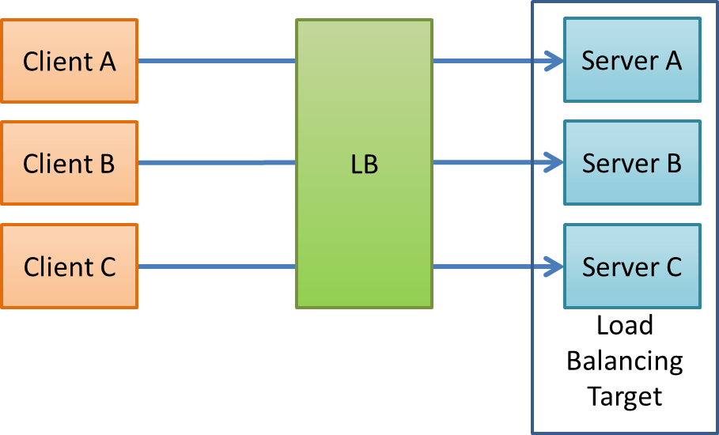
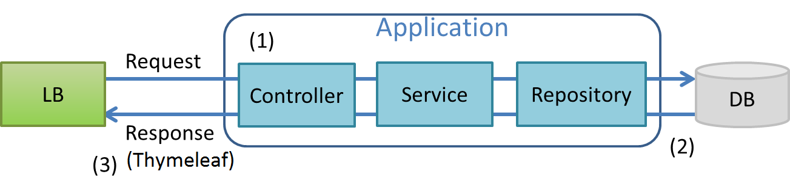

ヘルスチェック
--------------------------------------------------------------------------------

.. only:: html

.. contents:: 目次
  :depth: 4
  :local:

|

.. _HealthCheckOverview:

Overview
^^^^^^^^^^^^^^^^^^^^^^^^^^^^^^^^^^^^^^^^^^^^^^^^^^^^^^^^^^^^^^^^^^^^^^^^^^^^^^^^

| 本節では、ヘルスチェックについて説明する。
|

.. _HealthCheckOverview-Loadbalancer:

ロードバランサの負荷分散と縮退運転
""""""""""""""""""""""""""""""""""""""""""""""""""""""""""""""""""""""""""""""""

| Webシステムが大量のユーザからリクエストを受けることを想定し、ロードバランサ（以下、LBと言う）を利用する。
| LBは複数のサーバにリクエストを割り振ることでWebシステムにかかる負荷を分散する装置であり、サーバの追加・削除により、柔軟にWebシステムの処理能力を変更できるのが特徴である。
| ヘルスチェックは、LBがリクエストを割り振る各サーバの稼働状況を監視する機能である。LBはヘルスチェックを利用し、異常を検知したサーバにリクエストを割り振らず、正常に稼働しているサーバに割り振る。これにより、特定のサーバで障害が発生した場合も、Webシステムを停止することなく運用することが可能である。（これを縮退運転と呼ぶ）

| 以下の例では、LBは3台のサーバを管理し、リクエストを割り振っている。

  \ **Picture - About Load Balancing**\

| LBは定期的にサーバにリクエストを送信し、サーバから返されたステータスコードやレスポンスを確認することで、サーバの稼働状況を監視する。図のサーバAで異常が発生した場合、LBがそれを検知し、サーバAにリクエストを割り振らないようにする。
| 元々サーバAに接続していたクライアントAは、LBによって、他のサーバ(ここではサーバB)にリクエストを割り振られる。

.. figure:: ./images_HealthCheck/healthcheck-overview-flow-failure.png
  :width: 100%

  \ **Picture - About Fallback**\

|

ヘルスチェックの種類
""""""""""""""""""""""""""""""""""""""""""""""""""""""""""""""""""""""""""""""""

| LBが行うヘルスチェックには、さまざまな種類がある。以下に例を示す。

.. figure:: ./images_HealthCheck/healthcheck-overview-healthcheckFlow.png
  :width: 100%

  \ **Picture - HealthCheck Example**\

|

.. tabularcolumns:: |p{0.10\linewidth}|p{0.20\linewidth}|p{0.70\linewidth}|
.. list-table::
  :header-rows: 1
  :widths: 10 20 70

  * - 項番
    - ヘルスチェックの種類
    - 詳細
  * - | (1)
    - | PINGでのヘルスチェック
    - | OSI参照モデルのネットワーク層レベルで稼働状況を確認する。サーバ(OS)に対してPINGを送信し、応答があれば稼働していると判断する。
  * - | (2)
    - | TCP/UDPでのヘルスチェック
    - | OSI参照モデルのトランスポート層レベルで稼働状況を確認する。Web/APサーバのTCPポート（またはUDPポート）にリクエストを送信し、応答があれば稼働していると判断する。
  * - | (3)
    - | アプリケーションでのヘルスチェック
    - | OSI参照モデルのアプリケーション層レベルで稼働状況を確認する。Web/APサーバ上で稼働するアプリケーションにHTTPリクエストを送信し、応答が正常であれば稼働していると判断する。

| PINGやTCP/UDPでのヘルスチェックでは、アプリケーションの稼働状況までは確認できない。Webアプリケーションを対象とした場合は、サーバ(OS)やWeb/APサーバが稼働しているだけでは不十分であり、アプリケーションが稼働している必要がある。
| そのため本ガイドラインでは、アプリケーションでのヘルスチェックを行うことを推奨する。
|

.. _HealthCheckOverview-Implementation:

本ガイドラインで示すヘルスチェックの構成
""""""""""""""""""""""""""""""""""""""""""""""""""""""""""""""""""""""""""""""""

| 本ガイドラインでは、アプリケーションでのヘルスチェックを行うための、アプリケーションの実装例を紹介する。
| 具体的には、LBからのリクエストを受け取る、以下の図のような構成のハンドラを実装する。

  \ **Picture - HealthCheck Configuration**\

|

.. tabularcolumns:: |p{0.10\linewidth}|p{0.90\linewidth}|
.. list-table::
  :header-rows: 1
  :widths: 10 90

  * - 項番
    - 説明
  * - | (1)
    - | LBからのリクエストを受け、Controller、Service、Repositoryを実行する。
      | 単に稼働状況を確認する、という点では、よりシンプルにヘルスチェックを実現する方法も存在する。しかし本ガイドラインでは、ヘルスチェックによってアプリケーションが使用している仕組みやフレームワーク自体が正しく動作していることも確認するべく、対象アプリの使用技術構成にできる限り近づけるために、Controller、Service、Repositoryを実装する。
  * - | (2)
    - | RepositoryからSQLを発行し、データベースが稼働していることを確認する。
      | これは、データベースアクセスを伴うアプリケーションの場合、アプリケーションが稼働していても、データベースに異常がある場合は正常に業務を行うことができないためである。
  * - | (3)
    - | レスポンスを返すViewとしてThymeleafを使用する。
      | 本ガイドラインではThymeleafを例にとって説明するが、RESTやSOAPを用いる場合など、アプリケーションの特性に合わせて通信方式やレスポンス形式は適宜変更すること。詳細は、\ :doc:`../WebServiceDetail/REST`\や、\ :doc:`../../Appendix/SOAP`\を参照されたい。

| 本ガイドラインの実装例で返却されるステータスコードおよびレスポンスは以下の通りである。

.. tabularcolumns:: |p{0.25\linewidth}|p{0.30\linewidth}|p{0.30\linewidth}|
.. list-table::
  :header-rows: 1
  :widths: 25 30 30

  * - ヘルスチェック処理結果
    - ステータスコード
    - レスポンス内容
  * - | 成功
    - | 200(正常)
    - | \ ``OK.``\ の3文字
  * - | エラー発生
    - | 例外ハンドリング機能で設定されたステータスコード
    - | 例外ハンドリング機能で設定されたレスポンス

| 例外ハンドリングの設定を変更する場合は、\ :doc:`../../../ArchitectureInDetail/WebApplicationDetail/ExceptionHandling`\ を参照されたい。
|

.. _HealthCheckHowToUse:

How to use
^^^^^^^^^^^^^^^^^^^^^^^^^^^^^^^^^^^^^^^^^^^^^^^^^^^^^^^^^^^^^^^^^^^^^^^^^^^^^^^^

| \ :ref:`HealthCheckOverview-Implementation`\ で示した実装例について説明する。
|

.. _HealthCheckHowToUseRepository:

Repositoryインタフェース
""""""""""""""""""""""""""""""""""""""""""""""""""""""""""""""""""""""""""""""""

| まず、\ ``HealthCheckRepository``\ を作成する。\ ``HealthCheckRepository``\ はヘルスチェック用のSQLを実行し、データベースの稼働を確認する
| なお、ここではMyBatis3を用いてデータベースにアクセスする例を示す。他の方式を採用する場合は\ :doc:`../../../ArchitectureInDetail/DataAccessDetail/index`\ を参照されたい。

\ **HealthCheckRepository.java**\

.. code-block:: java

  package com.example.domain.repository.healthcheck;
   
  public interface HealthCheckRepository {
      void healthcheck();
  }

| ここでは、データベースへのアクセスが正しく行えていることさえ確認できればよいので、必要最小限のSQLを設定する。
| 本ガイドラインでは、SQLは以下の条件を満たすように設定している。

* 参照系であること
* パラメータが不要であること

| 以下は、PostgreSQLを使用した場合のマッピングファイルの例である。

\ **HealthCheckRepository.xml(PostgreSQLを使用した場合)**\

.. code-block:: xml

   <?xml version="1.0" encoding="UTF-8"?>
   <!DOCTYPE mapper PUBLIC "-//mybatis.org//DTD Mapper 3.0//EN"
      "http://mybatis.org/dtd/mybatis-3-mapper.dtd">

   <mapper namespace="com.example.domain.repository.healthcheck.HealthCheckRepository">

      <select id="healthcheck" resultType="String">
         SELECT '1'
      </select>

   </mapper>

| また、以下は、Oracleを使用した場合のマッピングファイルの例である。

\ **HealthCheckRepository.xml(Oracleを使用した場合)**\

.. code-block:: xml

   <?xml version="1.0" encoding="UTF-8"?>
   <!DOCTYPE mapper PUBLIC "-//mybatis.org//DTD Mapper 3.0//EN"
      "http://mybatis.org/dtd/mybatis-3-mapper.dtd">

   <mapper namespace="com.example.domain.repository.healthcheck.HealthCheckRepository">

      <select id="healthcheck" resultType="String">
         SELECT '1' FROM DUAL
      </select>

   </mapper>

|

.. _HealthCheckHowToUseService:

Serviceクラス
""""""""""""""""""""""""""""""""""""""""""""""""""""""""""""""""""""""""""""""""

| 次に、\ ``HealthCheckService``\ インタフェースと、\ ``HealthCheckService``\ インタフェースを実装した\ ``HealthCheckServiceImpl``\ クラスを作成する。
| \ ``HealthCheckServiceImpl``\ は、\ ``healthcheckRepository``\ の\ ``healthcheck``\ メソッドを呼び出し、データベースのヘルスチェックを行う。

\ **HealthCheckService.java**\

.. code-block:: java

  package com.example.domain.service.healthcheck;

  public interface HealthCheckService {
      void healthcheck();
  }

\ **HealthCheckServiceImpl.java**\

.. code-block:: java

  package com.example.domain.service.healthcheck;

  import healthcheck.domain.repository.healthcheck.HealthCheckRepository;
   
  import org.springframework.stereotype.Service;
  import org.springframework.transaction.annotation.Transactional;

  import jakarta.inject.Inject;

  @Service
  @Transactional
  public class HealthCheckServiceImpl implements HealthCheckService {
   
      @Inject
      HealthCheckRepository healthcheckRepository;
      
      @Override
      public void healthcheck() {
          healthcheckRepository.healthCheck();
      }
  }

|

.. _HealthCheckHowToUseController:

Controllerクラス
""""""""""""""""""""""""""""""""""""""""""""""""""""""""""""""""""""""""""""""""

| 次に、\ ``HealthCheckController``\を作成する。
| \ ``HealthcheckService``\ の\ ``healthcheck``\ メソッドを呼び出し、実行結果によって指定されたパスに遷移する。データベースの稼働が確認できた場合は、\ ``OK.``\ を表示するためのビューを返す。

\ **HealthCheckController.java**\

.. code-block:: java
   
  package com.example.app.healthcheck;

  import healthcheck.domain.service.healthcheck.HealthCheckService;

  import org.springframework.stereotype.Controller;
  import org.springframework.web.bind.annotation.GetMapping;

  import jakarta.inject.Inject;

  @Controller
  public class HealthCheckController {
   
      @Inject
      HealthCheckService healthcheckService;

      @GetMapping(value = "healthcheck") // (1)
      public String healthcheck(){
         healthcheckService.healthcheck();
         return "common/healthcheck/ok";
      }
  }

|

  .. tabularcolumns:: |p{0.10\linewidth}|p{0.90\linewidth}|
  .. list-table::
    :header-rows: 1
    :widths: 10 90

    * - 項番
      - 説明
    * - | (1)
      - | \ ``value``\ 属性は、稼働状態を調べるためのヘルスチェック用のURLとなる。

|

.. note::

   本ガイドラインでは、ヘルスチェック機能は共通機能の扱いとして\ ``common``\配下のディレクトリに配置している。
   しかし、共通的な画面を全て\ ``common``\配下のディレクトリに配置してしまうと、ディレクトリが肥大化して管理が難しくなる。
   そのため、極力グルーピングを行い、適切なディレクトリ構成にすることを推奨する。

.. _HealthCheckHowToUseView:

ThymeleafのテンプレートHTML
""""""""""""""""""""""""""""""""""""""""""""""""""""""""""""""""""""""""""""""""

| 最後に、ヘルスチェック成功時に遷移するHTMLファイルを作成する。
| レスポンスのデータ量を最低限にするため、\ ``<html>``\ タグ等を記述しないようにする。

\ **ok.html**\

.. code-block:: html

  OK.

|

.. _HealthCheckHowToUseSecurity:

アクセス権の設定
""""""""""""""""""""""""""""""""""""""""""""""""""""""""""""""""""""""""""""""""

| ヘルスチェック処理を使用する際は、認証・認可機能などによりヘルスチェック用のURLがアクセス不可にならないように注意する必要がある。
| 例えば、どのロールでもアクセスできるようにするには、spring-security.xmlの\ ``<sec:intercept-url>``\ を設定する。
| \ ``/healthcheck``\ 配下の除外設定を行う例を以下に示す。
| 詳細は\ :doc:`../../../Security/Authorization`\ を参照されたい。

\ **spring-security.xml**\

.. code-block:: xml

  <sec:http request-matcher="ant">
      <sec:intercept-url pattern="/healthcheck/**" access="permitAll"/>
      <!-- omitted -->
   </sec:http>

.. note::

  認可制御を外すと、誰でもヘルスチェック用URLにアクセスできるようになってしまうので、外部からアクセスされたくない場合はLBなどで防ぐ対処が必要である。

|

.. raw:: latex

  \newpage
