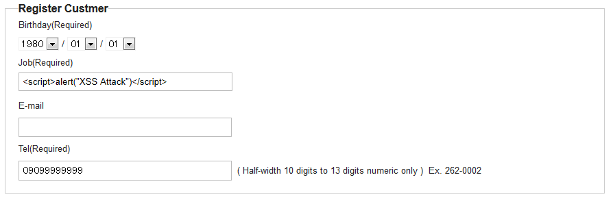
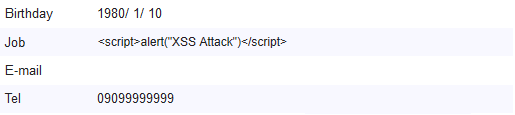
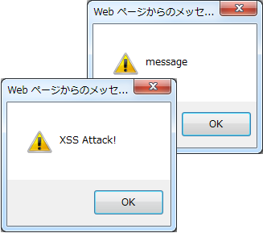
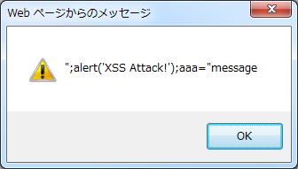
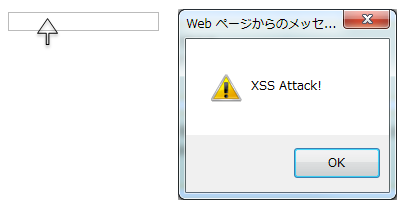

XSS対策
================================================================================

.. only:: html

 .. contents:: 目次
    :local:

.. _SpringSecurityXSS:

Overview
--------------------------------------------------------------------------------

クロスサイトスクリプティング(以下、XSSと略す)について説明する。
クロスサイトスクリプティングとは、アプリケーションのセキュリティ上の不備を意図的に利用し、サイト間を横断して悪意のあるスクリプトを混入させることである。
例えば、ウェブアプリケーションが入力したデータ（フォーム入力など）を、適切にエスケープしないまま、HTML上に出力することにより、入力値に存在するタグなどの文字が、そのままHTMLとして解釈される。
悪意のある値が入力された状態で、スクリプトを起動させることにより、クッキーの改ざんや、クッキーの値を取得することによる、セッションハイジャックなどの攻撃が行えてしまう。

Stored, Reflected XSS Attacks
^^^^^^^^^^^^^^^^^^^^^^^^^^^^^^^^^^^^^^^^^^^^^^^^^^^^^^^^^^^^^^^^^^^^^^^^^^^^^^^^

XSS攻撃は、大きく二つのカテゴリに分けられる。

**Stored XSS Attacks**

Stored XSS Attacksとは、悪意のあるコードが、永久的にターゲットサーバ上(データベース等)に格納されていることである。
ユーザーは、格納されている情報を要求するときに、サーバから悪意のあるスクリプトを取得し、実行してしまう。

**Reflected XSS Attacks**

Reflected attacksとは、リクエストの一部としてサーバに送信された悪意のあるコードが、エラーメッセージ、検索結果、その他いろいろなレスポンスからリフレクションされることである。
ユーザーが、悪意のあるリンクをクリックするか、特別に細工されたフォームを送信すると、挿入されたコードは、ユーザーのブラウザに、攻撃を反映した結果を返却する。
その結果、信頼できるサーバからきた値のため、ブラウザは悪意のあるコードを実行してしまう。

Stored XSS Attacks、Reflected XSS Attacksともに、出力値をエスケープすることで防ぐことができる。

How to use
""""""""""""""""""""""""""""""""""""""""""""""""""""""""""""""""""""""""""""""""

ユーザーの入力を、そのまま出力している場合、XSSの脆弱性にさらされている。
したがって、XSSの脆弱性に対する対抗措置として、HTMLのマークアップ言語で、特定の意味を持つ文字をエスケープする必要がある。

必要に応じて、3種類のエスケープを使い分けること。

エスケープの種類:

 * Output Escaping
 * JavaScript Escaping
 * Event handler Escaping

.. _xss_how_to_use_ouput_escaping:

Output Escaping
^^^^^^^^^^^^^^^^^^^^^^^^^^^^^^^^^^^^^^^^^^^^^^^^^^^^^^^^^^^^^^^^^^^^^^^^^^^^^^^^

XSSの脆弱性への対応としては、HTML特殊文字をエスケープすることが基本である。
HTMLにおいてエスケープが必要な特殊文字の例と、エスケープ後の例は、以下の通りである。

.. tabularcolumns:: |p{0.50\linewidth}|p{0.50\linewidth}|
.. list-table::
   :header-rows: 1
   :widths: 50 50

   * - | エスケープ前
     - | エスケープ後
   * - | "``&``"
     - | ``&amp;``
   * - | "``<``"
     - | ``&lt;``
   * - | "``>``"
     - | ``&gt;``
   * - | "\ ``"``\"
     - | ``&quot;``
   * - | "``'``"
     - | ``&#39;``

Thymeleafでテキストを出力する方法には\ ``th:text``\属性、\ ``th:utext``\属性の二種類が存在する。
詳細は、\ `Unescaped Text <http://www.thymeleaf.org/doc/tutorials/3.0/usingthymeleaf.html#unescaped-text>`_\ を参照されたい。

 * \ ``th:text``\属性を使用すると値をエスケープして出力する
 * \ ``th:utext``\属性を使用すると値をエスケープせずに出力する

XSSを防ぐために、\ ``th:text``\属性を使用すること。

入力値を、別画面に再出力するアプリケーションを例に、説明する。

出力値をエスケープしない脆弱性のある例
""""""""""""""""""""""""""""""""""""""""""""""""""""""""""""""""""""""""""""""""

本例は、あくまで参考例として載せているだけなので、以下のような実装は、決して行わないこと。

**出力画面の実装**

.. code-block:: html

    <!-- omitted -->
    <tr>
        <td>Job</td>
        <td th:utext="${customerForm.job}">Job</td>  <!-- (1) -->
    </tr>
    <!-- omitted -->

.. tabularcolumns:: |p{0.10\linewidth}|p{0.90\linewidth}|
.. list-table::
   :header-rows: 1
   :widths: 10 90

   * - 項番
     - 説明
   * - | (1)
     - | \ ``th:utext``\ 属性を使用することにより、customerFormのフィールドであるjobをエスケープせず出力している。

入力画面のJobフィールドに、
``
  
  **出力結果**
  
    .. code-block:: html
    
      
&lt;/p&gt;&lt;script&gt;alert(&#39;XSS Attack!&#39;)&lt;/script&gt;&lt;p&gt;

    

.. _xss_how_to_use_javascript_escaping:

JavaScript Escaping
^^^^^^^^^^^^^^^^^^^^^^^^^^^^^^^^^^^^^^^^^^^^^^^^^^^^^^^^^^^^^^^^^^^^^^^^^^^^^^^^

XSSの脆弱性への対応としては、JavaScript特殊文字をエスケープすることが基本である。
ユーザーからの入力をもとに、JavaScriptの文字列リテラルを動的に生成する場合に、エスケープが必要となる。

JavaScriptにおいてエスケープが必要な特殊文字の例と、エスケープ後の例は、以下のとおりである。

.. tabularcolumns:: |p{0.50\linewidth}|p{0.50\linewidth}|
.. list-table::
   :header-rows: 1
   :widths: 50 50

   * - | エスケープ前
     - | エスケープ後
   * - | "``'``"
     - | ``\'``
   * - | "\ ``"``\"
     - | ``\"``
   * - | ``\``
     - | ``\\``
   * - | "``/``"
     - | ``\/``
   * - | "``<``"
     - | ``\x3c``
   * - | "``>``"
     - | ``\x3e``
   * - | ``0x0D(復帰)``
     - | ``\r``
   * - | ``0x0A(改行)``
     - | ``\n``

出力値をエスケープしない脆弱性のある例
""""""""""""""""""""""""""""""""""""""""""""""""""""""""""""""""""""""""""""""""

XSS問題が発生する例を、以下に示す。

本例は、あくまで参考例として載せているだけなので、以下のような実装は、決して行わないこと。

.. code-block:: html

  <html>
    
  </html>

.. tabularcolumns:: |p{0.10\linewidth}|p{0.90\linewidth}|
.. list-table::
   :header-rows: 1
   :widths: 10 90

   * - 項番
     - 説明
   * - | (1)
     - | [(xxx)]の形式を用いたインライン記法により、\ ``warnCode``\をエスケープせず出力している。

.. tabularcolumns:: |p{0.20\linewidth}|p{0.80\linewidth}|
.. list-table::
   :header-rows: 1
   :widths: 20 80

   * - 属性名
     - 値
   * - | warnCode
     - | ``";alert('XSS Attack!');aaa="message``

上記例のように、ユーザーの入力を導出元としてコードを出力するなど、JavaScriptの要素を動的に生成する場合、意図せず文字列リテラルが閉じられ、XSSの脆弱性が生じる。

   **Picture - No Escape Result**

**出力結果**

.. code-block:: html

    

.. tip::

    業務要件上必要でない限り、JavaScriptの要素をユーザーからの入力値に依存して動的に生成する仕様は、任意のスクリプトが埋め込まれてしまう可能性があるため、別の方式を検討する、または、極力避けるべきである。

.. _xss_how_to_use_js_function_example:

出力値をエスケープする例
""""""""""""""""""""""""""""""""""""""""""""""""""""""""""""""""""""""""""""""""

XSSを防ぐために、Thymeleafの\ ``th:inline="javascript"``\ の使用を推奨する。詳細は、\ `JavaScript inlining <http://www.thymeleaf.org/doc/tutorials/3.0/usingthymeleaf.html#javascript-inlining>`_\ を参照されたい。

使用例を、下記に示す。

.. code-block:: html

    

.. tabularcolumns:: |p{0.10\linewidth}|p{0.90\linewidth}|
.. list-table::
   :header-rows: 1
   :widths: 10 90

   * - 項番
     - 説明
   * - | (1)
     - | \ ``th:inline="javascript"``\ と[[xxx]]の形式を用いたインライン記法を併用することにより、エスケープして変数に設定している。

   **Picture - Escape Result**

**出力結果**

.. code-block:: html

    

.. note:: 

   \ ``th:inline="javascript"``\と[[xxx]]の形式を用いたインライン記法を併用すると、文字列が"\ ``"``\"に挟まれた状態で出力されるので、"\ ``'``\"はエスケープ不要となる。
   
   また、のようにタグを閉じるまで他のタグは認識されない。
   そのため、"\ ``/``\"がエスケープされていれば、"\ ``<``\"、"\ ``>``\"のエスケープは不要となる。
   
   以上のことから、以下の特殊文字は\ ``th:inline="javascript"``\のエスケープ対象に入っていない。

   * "\ ``'``\"
   * "\ ``<``\"
   * "\ ``>``\"

.. Warning::

    スクリプトタグが含まれる値を、HTMLエスケープせず\ ``th:inline="javascript"``\でエスケープさせて出力する場合、document.write()を使用すると、
    ブラウザにHTMLソースとして解釈させるよう出力するので、XSSの脆弱性が生じる。以下に例を示すが、 **このような実装は決して行わないこと。**

    **HTML**

      .. code-block:: html

        

      .. tabularcolumns:: |p{0.20\linewidth}|p{0.80\linewidth}|
      .. list-table::
         :header-rows: 1
         :widths: 20 80

         * - 属性名
           - 値
         * - | warnCode
           - | ````

    **出力結果**

      .. code-block:: html

        

    出力結果をソースだけ確認するとエスケープできているように見える。
    しかし、これは\ ```` \という内容の文字列を変数aaaに格納するコードとなるため、
    \ ``document.write(aaa);`` \と実装してしまうと、HTMLのソースとして\ ```` \を出力することになる。
    その結果、スクリプトが実行される。

    ブラウザに値を出力させたい場合は、JavaScriptを使用せず、HTML特殊文字をエスケープする\ ``th:text``\属性を使用することが望ましい。

    **HTML**

      .. code-block:: html

        
warn code

                

    **出力結果**

      .. code-block:: html

        
&lt;script&gt;alert(&#39;XSS Attack!&#39;);&lt;/script&gt;

    あえてdocument.write()で出力したい場合は、以下のいずれかのような、追加のXSS対策が必要である。

    * HTMLエスケープ用のJavaScript関数を用意し、document.write()の引数をエスケープする。
    * \ ``th:text``\属性でユーザーの入力値が設定される値をHTMLエスケープした後、\ ``th:inline="javascript"``\でJavaScriptの文字列リテラル用のエスケープを行う。

.. _xss_how_to_use_event_handler_escaping:

Event handler Escaping
^^^^^^^^^^^^^^^^^^^^^^^^^^^^^^^^^^^^^^^^^^^^^^^^^^^^^^^^^^^^^^^^^^^^^^^^^^^^^^^^

javascript のイベントハンドラの値をエスケープする場合、Thymeleafの\ ``#strings.escapeJavaScript()``\ を使用する。

理由としては、 \ ``<input type="submit" onclick="callback('xxxx');">``\ のようなイベントハンドラの値に\ ``');alert("XSS Attack");//``\ を指定された場合、別のスクリプトを挿入できてしまうため、文字参照形式にエスケープ後、HTMLエスケープを行う必要がある。

.. note:: 

   \ ``#strings.escapeJavaScript()``\ を使用すると、"\ ``/``\"のエスケープは\ ``</script>``\のようなタグを閉じる際にのみ必要となるため、"\ ``<``\"の後の"\ ``/``\"のみエスケープが行われる。

出力値をエスケープしない脆弱性のある例
""""""""""""""""""""""""""""""""""""""""""""""""""""""""""""""""""""""""""""""""
XSS問題が発生する例を、以下に示す。

.. code-block:: html

    <input type="text" th:onmouseover="|alert('output is ${warnCode}.')|">

.. tabularcolumns:: |p{0.20\linewidth}|p{0.80\linewidth}|
.. list-table::
   :header-rows: 1
   :widths: 20 80

   * - 属性名
     - 値
   * - | warnCode
     - | ``'); alert('XSS Attack!'); //``
       | 上記の値が設定されてしまうことで、意図せず文字列リテラルが閉じられ、XSSの脆弱性が生じる。

マウスオーバ時、XSSのダイアログボックスが表示されてしまう。

   **Picture - No Escape Result**

**出力結果**

.. code-block:: html

    <!-- omitted -->
    <input type="text" onmouseover="alert(&#39;output is &#39;); alert(&#39;XSS Attack!&#39;); //.&#39;)">
    <!-- omitted -->

.. _xss_how_to_use_hjs_function_example:

出力値をエスケープする例
""""""""""""""""""""""""""""""""""""""""""""""""""""""""""""""""""""""""""""""""

使用例を、下記に示す。

.. code-block:: html

    <input type="text" th:onmouseover="|alert('output is ${#strings.escapeJavaScript(warnCode)}.')|">  // (1)

.. tabularcolumns:: |p{0.10\linewidth}|p{0.90\linewidth}|
.. list-table::
   :header-rows: 1
   :widths: 10 90

   * - 項番
     - 説明
   * - | (1)
     - | \ ``#strings.escapeJavaScript()``\ を使用することにより、エスケープしている。

マウスオーバ時、XSSのダイアログは出力されない。

.. figure:: ./images_XSS/eventhandler_xss_screen_escape_result.png
   :alt: eventhandler_xss_screen_escape_result
   :width: 50%
   :align: center

   **Picture - Escape Result**

**出力結果**

.. code-block:: html

    <!-- omitted -->
    <input type="text" onmouseover="alert(&#39;output is \&#39;); alert(\&#39;XSS Attack!\&#39;); //.&#39;)">
    <!-- omitted -->

.. raw:: latex

   \newpage

